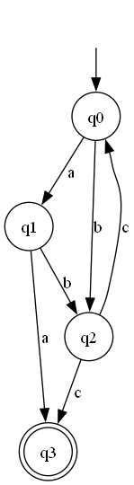
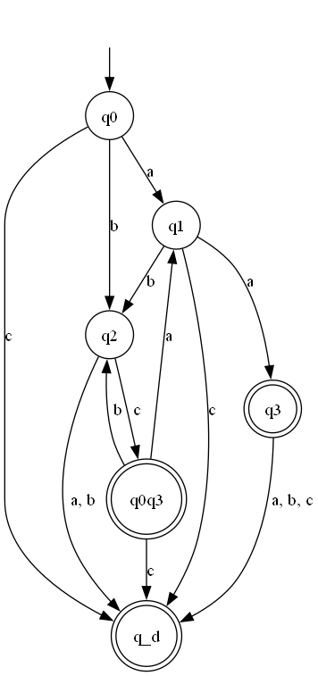
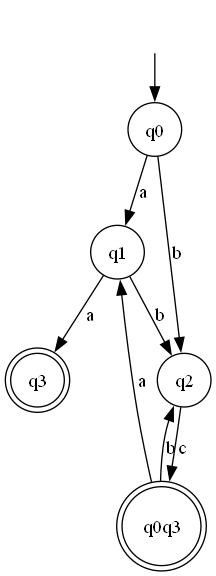
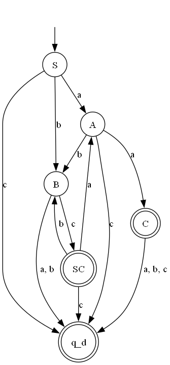
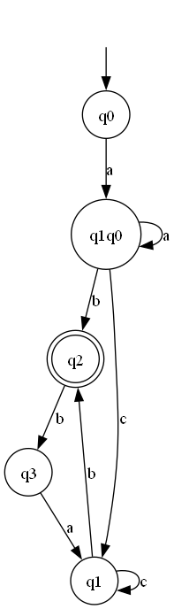

# Determinism in Finite Automata. Conversion from NDFA 2 DFA. Chomsky Hierarchy.

### Course: Formal Languages & Finite Automata
### Author: Gusev Roman
### Academic Group: FAF-222

----

## Theory:
* ### Definitions:
  * **Grammar**: A grammar is a set of rules used to generate strings in a formal language. It consists of a finite set of symbols called the alphabet, along with a set of production rules that specify how symbols from the alphabet can be combined to form strings.
  * **Finite Automaton**: A finite automaton is a mathematical model used to recognize patterns within strings. It consists of a finite set of states, a set of transitions between these states, and a set of input symbols. Finite automata can be deterministic (DFA) or nondeterministic (NFA) depending on the rules governing the transitions.
  * **NFA**: A Nondeterministic Finite Automaton (NFA) is a type of finite automaton where for some transitions, there may be multiple possible next states for a given input symbol. This allows for greater flexibility in recognizing patterns compared to deterministic finite automata.
  * **DFA**: A Deterministic Finite Automaton (DFA) is a type of finite automaton where each transition is uniquely determined by the current state and the input symbol. DFAs are simpler than NFAs but have equivalent recognition power.
  * **Chomsky Hierarchy**: The Chomsky Hierarchy is a classification of formal grammars into four types based on their generative power. These types are Type 0 (unrestricted grammars), Type 1 (context-sensitive grammars), Type 2 (context-free grammars), and Type 3 (regular grammars), arranged in increasing order of generative power. This hierarchy is named after the linguist Noam Chomsky, who introduced it in the 1950s.

## Objectives:

* Understand what an automaton is and what it can be used for;
* Continuing the work in the same repository and the same project, the following need to be added: 
  1. Provide a function in your grammar type/class that could classify the grammar based on Chomsky hierarchy.
  2. For this you can use the variant (11) from the previous lab;
* According to my variant number (11), get the finite automaton definition and do the following tasks:
  1. Implement conversion of a finite automaton to a regular grammar;
  2. Determine whether your FA is deterministic or non-deterministic;
  3. Implement some functionality that would convert an NDFA to a DFA;
  4. Represent the finite automaton graphically (Optional, and can be considered as a **_bonus point_**);
     1. You can use external libraries, tools or APIs to generate the figures/diagrams;
     2. Your program needs to gather and send the data about the automaton and the lib/tool/API return the visual representation.
## Implementation description
* For the start, I used the files that were developed in the previous [Laboratory Work nr.1](../Laboratory-Work-1-Grammar-Finite-Automaton).
During the development of the project for current Laboratory Work, I enhanced some features that were implemented in the
previous work. Specifically, judging by the format of Finite Automaton from my Variant in current Laboratory Work, I changed
the code a bit in order for it to take as input also Grammars and Finite Automatons that uses notation "q_" of the Non-Terminal
Terms.
```python
class Grammar:
    ...
    try:
        state_index = terms.index("q")
    except ValueError:
        state_index = -1
    if state_index >= 0 and terms[state_index + 1].isnumeric():
        terminal_terms = terms[:state_index]
        for term in terminal_terms:
            current_input_term += term
        next_state = "".join(terms[state_index: state_index + 2])
    else:
        for term in terms:
            if term.islower() and term in delta:
                current_input_term += term
            if term.isupper() and term in Q:
                next_state = term
    ...
```
* At the same time, I developed an algorithm that will take input grammar from the user. It is done in similar manner as
in the previous Laboratory Work - there was possible to input the Finite Automaton using terminal. Now it can be done for
both Grammar and Finite Automaton, in both classical formats - using Uppercase letters for Non-Terminals and "q_" notation.
```python
class Grammar:
    ...
    def create_grammar(self):
          print("CREATE YOUR OWN GRAMMAR:")
    
          V_n = input("INPUT NON-TERMINAL TERMS SEPARATED BY COMMA: ")
          V_n = V_n.split(",")
          print(V_n)
          self.V_n = V_n
    
          V_t = input("INPUT TERMINAL TERMS SEPARATED BY COMMA: ")
          V_t = V_t.split(",")
          print(V_t)
          self.V_t = V_t
    
          S = input("INPUT START TERM: ")
          print(S)
          self.S = S
    
          print(
              "INPUT RULES (SEPARATED BY COMMA \"{LEFT-HAND SIDE},{RIGHT-HAND SIDE}\"): ")
          P = {}
          while True:
              rule_string = input("")
              rule = rule_string.split(",")
              print(rule)
              LHS = rule[0]
              print(LHS)
              if LHS in P:
                  P[LHS].append(rule[1])
              else:
                  P[LHS] = [rule[1]]
              print(f"{rule[0]} -> {rule[1]}")
              if input("CONTINUE? (Y/N) ").lower() == "n":
                  break
          self.P = P
    ...
```

* For the first task - develop an algorithm that will classify Grammars by Chomsky Hierarchy, I decided to delve in the 
research and found several rules for each Type from the Hierarchy:
  * Type 3 - Regular Grammar:
    * Left-Hand Side contains only one Non-Terminal
    * Right-Hand Side contains at least 1 Terminal Term and 1 or 0 Non-Terminals on either left or right side of the Terminal Term
  * Type 2 - Context-Free Grammar:
    * Left-Hand Side contains only one Non-Terminal
    * Right-Hand Side contains a String of Non-Terminal Terms and Terminal Terms
  * Type 1 - Context-Sensitive Grammar:
    * Left-Hand Side contains at least 1 Non-Terminal Term
    * Right-Hand Side contains a String of Non-Terminal Terms and Terminal Terms
    * Number of Terms in Right-Hand Side should be higher or equal to Number of Terms in Left-Hand Side
  * Type 0 - Unrestricted Grammar:
    * Left-Hand Side contains at least 1 Non-Terminal Term
    * Right-Hand Side contains a String of Non-Terminal Terms and Terminal Terms
I implemented those rules and took in count that there are multiple types of Regular Grammars, such as:
  * Right Linear Regular Grammar - Non-Terminal Terms are on the right of the Terminal Term in RHS
  * Left Linear Regular Grammar - Non-Terminal Terms are on the left of the Terminal Term in RHS
  * Extended Right Linear Regular Grammar - Non-Terminal Terms are on the right of the multiple Terminal Terms in RHS
  * Extended Left Linear Regular Grammar - Non-Terminal Terms are on the left of the multiple Terminal Terms in RHS
These types of the classification were done easily by counting the number of characters in the RHS.
Also, I handled the case when Grammar is invalid and will be classified as Invalid.

First of all, I initialized booleans that will hold the type of the grammar.
```python
class Grammar:
    ...
    def check_type_grammar(self):
        # Check if Grammar is Extended Regular Grammar
        is_extended = False

        # Check if Grammar is Left Linear Regular Grammar
        is_left_linear = True

        # Check if Grammar is Right Linear Regular Grammar
        is_right_linear = True

        # Check if Grammar is Regular Grammar
        is_type_3 = True

        # Check if Grammar is Context-Free Grammar
        is_type_2 = True

        # Check if Grammar is Context-Sensitive Grammar
        is_type_1 = True

        # Check if Grammar is Unrestricted Grammar
        is_type_0 = True

        # Check if Grammar is Invalid
        is_invalid = False
        ...
```

* Here, I check if during the checks of the Rules, the grammar is valid - if no, exit the loop and that's it. Otherwise
I check the edge-case when the grammar contains rules that involve terms that are not in the Lists that hold them.
After that, I check the RHS on containing invalid Terms, both Terminal and Non-Terminal.
```python
class Grammar:
    ...
    def check_type_grammar(self):
        ...
        for LHS, RHS_list in self.P.items():
            # If Grammar is Invalid, exit loop.
            if is_invalid:
                break

            # Edge-Case: Not valid Non-Terminal Term Left-Hand Side
            for term in LHS:
                if term not in self.V_n and term.isupper():
                    is_invalid = True
                    break

            # Check if already invalid => no need to check further
            if is_invalid:
                break
            # Edge-Case: Not valid Terminal Term or Non-Terminal Term in Right-Hand Side
            else:
                for production in RHS_list:
                    if is_invalid:
                        break
                    for term_prod in production:
                        # Not Valid Terminal Term
                        if term_prod.islower() and term_prod not in self.V_t:
                            print(f"Term {term_prod} is not valid Terminal Term!")
                            is_invalid = True
                            break

                        # Not Valid Non-Terminal Term
                        if term_prod.isupper() and term_prod not in self.V_n:
                            print(f"Term {term_prod} is not valid Non-Terminal Term!")
                            is_invalid = True
                            break
        ...
```

* Here, I check if the LHS has multiple Non-Terminal Terms, then the grammar is not of Type 3 and 2. Then, I check if the
length of the LHS is greater than the length of the RHS. If yes, then it is not Type 1 and is Type 0 Grammar, otherwise - continue checking further.
```python
class Grammar:
    ...
    def check_type_grammar(self):
        ...
        # If Left-Hand Side has more than one Non-Terminal Term, then Grammar is not Regular and not Context-Free
        if len(LHS) != 1:
            is_type_3 = False
            is_type_2 = False

            # If the length of Left-Hand Side is greater than at least one Right-Hand Side => Grammar is not
            # Context-Sensitive
            for RHS in RHS_list:
                if len(LHS) > len(RHS):
                    is_type_1 = False
        ...
```

* If the grammar is Type 3, then check for the RHS if it contains only one Non-Terminal Term, then Grammar is not of Type 4 and exit this loop.
If it's not the case, then check for linearity of the Grammars. If rules has both Left Linear Rules and Right Linear Rules, then
Grammar is not of Type 3 and is of Type 2. In the end, check for the multiple terminals on the sides of the Non-Terminal Terms in rules.
If there are more than 1 Terminal Term, then it is Extended Regular Grammar.
```python
class Grammar:
    ...
    def check_type_grammar(self):
        ...
        # If Regular Grammar and first term is Non-Terminal and rest are terminals, then Left Linear Regular Grammar
        if is_type_3:
            for RHS in RHS_list:
                if len(RHS) == 1 and not RHS[0].islower():
                    # If Right-Hand Side has one Non-Terminal Term and no Terminal Terms => Grammar is not Regular
                    if RHS[0] not in self.V_n:
                        is_type_3 = False
                        break
                    else:
                        continue

                # If Regular Grammar and first term is Non-Terminal and rest are terminals,
                # then Left Linear Regular Grammar
                if RHS[0].isupper():
                    if not is_left_linear:
                        is_type_3 = False
                        break
                    is_right_linear = False
                    for rest_terms in RHS[1:]:
                        for rest_term in rest_terms:
                            if rest_term.isupper():
                                is_type_3 = False
                                break
                # If Regular Grammar and last term is Non-Terminal and rest has at least one Non-Terminal,
                # then Grammar is not Regular
                if RHS[-1].isupper():
                    if not is_right_linear:
                        is_type_3 = False
                        break
                    is_left_linear = False
                    for rest_terms in RHS[:-1]:
                        for rest_term in rest_terms:
                            if rest_term.isupper():
                                is_type_3 = False
                                break

                # Check if Right-Hand Side is longer than 2 terms => Extended Regular Grammar
                if len(RHS) > 2 and is_type_3:
                    is_extended = True
        ...
```

* In the end, I print out the Type of the Grammar that is provided in the main class.
```python
class Grammar:
    ...
    def check_type_grammar(self):
        ...
        print("Grammar is: ", end="")
        if is_invalid:
            print("Invalid")
        elif is_type_3:
            if is_left_linear:
                if is_extended:
                    print("Type 3 - Extended Left Linear Regular Grammar")
                else:
                    print("Type 3 - Left Linear Regular Grammar")
            elif is_right_linear:
                if is_extended:
                    print("Type 3 - Extended Right Linear Regular Grammar")
                else:
                    print("Type 3 - Right Linear Regular Grammar")
        elif is_type_2:
            print("Type 2 - Context-Free Grammar")
        elif is_type_1:
            print("Type 1 - Context-Sensitive Grammar")
        elif is_type_0:
            print("Type 0 - Unrestricted Grammar")
```

* Next task - convert Finite Automaton to Regular Grammar, I followed the Algorithm described at the course of the LFA [[1]](#bib1).
First, Non-Terminal Terms are the States (here, in case that user don't want to add the final state from the FA to the Grammar, then
the final state is removed from the list), Terminal Terms are the Alphabet, Start Term is the Start State. Product set is constructed
based on the transitions. Also, in the end is added the final state if the user wants to.

```python
...
class FiniteAutomaton:
    ...
    def to_grammar(self, choice):
        # Non-Terminal Terms - will hold possible Non-Terminal Terms = States
        V_n = self.Q
        if choice == 0 and "q_f" in V_n:
            V_n.remove("q_f")
        # Terminal Terms - will hold possible Terminal Terms = Alphabet
        V_t = self.delta
        # Start Term = Start State
        S = self.q0
        # Product Set - will hold the Rules for the Grammar = Converted from Transition Set
        P = {}
        # Iterate over all the Transitions in the Transitions Dictionary (non-terminal term = current state
        # from the dictionary)
        for (state, term), next_states in self.sigma.items():
            for next_state in next_states:
                if choice == 1:
                    if state not in P:
                        P[state] = [term + next_state]
                    else:
                        P[state].append(term + next_state)
                elif choice == 0:
                    if state not in P:
                        if next_state != "q_f":
                            P[state] = [term + next_state]
                        else:
                            P[state] = [term]
                    else:
                        if next_state != "q_f":
                            P[state].append(term + next_state)
                        else:
                            P[state] = [term]

        if choice == 1:
            for final_state in self.F:
                if final_state not in P:
                    P[final_state] = ["\u03B5"]

        return Grammar.Grammar(V_n, V_t, P, S)
    ...
...
```

* Next Task - Check if FA is NFA or DFA. I decided to iterate over the transitions, and check if from a 
certain specific set of current State and Terminal Term can be achieved several next States, that causes ambiguity and
makes a Finite automaton to be Non-Deterministic Finite Automaton. Also, I store the ambiguous Transitions and display
them in console.
```python
class FiniteAutomaton:
    ...
    def NFA_or_DFA(self):
        # Initialize boolean for NFA check
        is_NFA = False
        # Initialize a list that will hold the relations with ambiguity
        ambiguous_states = {}
        # Iterate over next_States from state with the same term
        for (state, term), next_states in self.sigma.items():
            # If there are multiple possible unique next_States => ambiguity and choice in options => NFA
            if len(set(next_states)) > 1:
                is_NFA = True
                ambiguous_states[(state, term)] = next_states
        return is_NFA, ambiguous_states
    ...
```

* Next Task - Implement functionality that would convert an NFA to a DFA. Here, I check if the Finite Automaton is
already Deterministic, if it is - then no need to convert the FA and just return the same FA.
```python
class FiniteAutomaton:
    ...
    def to_DFA(self, choice):
        # Edge-Case: If FA is DFA, no need to convert
        if not self.NFA_or_DFA()[0]:
            print("Finite Automaton is already Deterministic!")
            return self
        ...
```

* Next Task - Implement functionality that would convert an NFA to a DFA. Here, I check if the Finite Automaton is
already Deterministic, if it is - then no need to convert the FA and just return the same FA.
```python
class FiniteAutomaton:
    ...
    def to_DFA(self, choice):
        # Edge-Case: If FA is DFA, no need to convert
        if not self.NFA_or_DFA()[0]:
            print("Finite Automaton is already Deterministic!")
            return self
        ...
```

* In order to convert the NFA to DFA, I decided to construct another FA that will be returned in the end with new variables
as input. Start State and Alphabet remains the same, but States List and Transitions will be changed, as in the algorithm
mentioned in the guidebook [[1]](#bib1), therefore I initialized them and introduced the Start State in the new States List as the first one.

```python
class FiniteAutomaton:
    ...
    def to_DFA(self, choice):
        ...
        # Start State
        q0_DFA = self.q0

        # Alphabet is the same
        delta_DFA = self.delta

        # New State List
        Q_DFA = [[q0_DFA]]

        # New Transition List
        sigma_DFA = {}
        ...
```

* First, I decided to iterate over the new list of States, as it is in the algorithm mentioned above - equivalent to the
analyzing new states that appear in the transition table. 
* Also, I iterate over all the terminal terms and try to find the
transition with this specific start that is being analyzed and with the Terminal Term that leads to new states. If the
analyzed state is a simple one - has only one State, then I try to find in the original Transitions List the transition
corresponding to the mentioned State and Terminal Term. 
* If the transition is not in the original set, then based on the 
choice of the user to add dead state (It will lead to Complete DFA), it will add the dead state to the new Transition List, otherwise, will
continue to the next iteration. Otherwise, if the next state is a single one, then add it directly to the new Transition List, otherwise
make it a single string that has 2 or more States. 
* Then add the next state to the new States List. In case that the new appeared
State is a complex one - contains more than 1 Simple State, then find the reunion of the next states of the component states.

```python
class FiniteAutomaton:
    ...
    def to_DFA(self, choice):
        ...
        # Iterate over the new States List
        for converted_state in Q_DFA:
            # Iterate over all terminal terms
            for terminal_term in delta_DFA:
                # Check if the state that is analyzed is not formed of multiple states
                if len(converted_state) == 1:
                    try:
                        l = [converted_state[0], terminal_term]
                        # If for the current single state that is analyzed exist a next state in original transitions
                        # table, find and place it in the new one, otherwise add the dead state or not, based on the
                        # choice of the user
                        next_state = self.sigma[tuple(l)]

                        if len(next_state) == 1:
                            sigma_DFA[tuple(l)] = next_state
                            if next_state not in Q_DFA:
                                Q_DFA.append(next_state)
                        else:
                            sigma_DFA[tuple(l)] = ["".join(next_state)]
                            if next_state not in Q_DFA:
                                Q_DFA.append(next_state)

                    except KeyError:
                        if choice == 1:
                            l = [converted_state[0], terminal_term]
                            next_state = "q_d"
                            sigma_DFA[tuple(l)] = [next_state]
                else:
                    combined_state = []
                    for curr_state in converted_state:
                        try:
                            l = [curr_state, terminal_term]

                            next_state = self.sigma[tuple(l)]

                            for part_state in next_state:
                                if part_state not in combined_state:
                                    combined_state.append(part_state)

                        except KeyError:
                            continue
        ...
```

* In order to add the new appeared complex State that is formed of multiple States, I take the combined State and add it to
the Transitions set with the according LHS of the Transition. Then, I add the combined state in the new States List.
* Additionally, if user wants to convert NFA to a Complete DFA, I check if the LHS of a transition is not present in the
new Transitions set and adds it with the next state - dead state.
```python
class FiniteAutomaton:
    ...
    def to_DFA(self, choice):
        ...
        for converted_state in Q_DFA:
            ...
            for terminal_term in delta_DFA:
                ...
                if len(converted_state) == 1:
                    ...
                else:
                    ...
                    # If New State list is not empty, then add to the new Transition Table and add to States List.
                    if combined_state:
                        sigma_DFA[tuple([tuple(converted_state), terminal_term])] = ["".join(combined_state)]
                        if combined_state not in Q_DFA:
                            Q_DFA.append(combined_state)
                    # If Complete DFA, then add the rest of the transitions to the Transition Set
                    if choice == 1:
                        if tuple([tuple(converted_state), terminal_term]) not in sigma_DFA:
                            sigma_DFA[tuple([tuple(converted_state), terminal_term])] = ["q_d"]
        ...
```

* After all the new transitions are built, I have to find the final states that are also new. If a state in the new States List
contains the final state from the original NFA, then add it to the new set of the Final States. After that, return the 
DFA that is a new object with the constructed variables.
```python
class FiniteAutomaton:
    ...
    def to_DFA(self, choice):
        ...
        F_DFA = []
        for final_state in self.F:
            for states in Q_DFA:
                if final_state in states:
                    F_DFA.append(states)

        return FiniteAutomaton(Q_DFA, delta_DFA, sigma_DFA, q0_DFA, F_DFA)
```

* Additionally, I decided to extend the Task regarding representation of the finite automaton graphically, that was done
in the [Laboratory Work nr.1](Laboratory-Work-1-Grammar-Finite-Automaton), and this method will also work for all types
of Finite Automatons and will all formats of those Finite Automatons. First of all, I decided to use Graphviz Library.
I instantiate a Digraph (Directed Graph), and put first all the available states on the graph.
```python
from graphviz import Digraph
...
class FiniteAutomaton:
    ...
    def draw_graph(self, name):
        graph = Digraph(comment='Graphical Representation of Finite Automaton')
        # Add states to the graph of Finite Automaton
        for state in self.Q:
            if state in self.F:
                graph.attr('node', shape='doublecircle')
            else:
                graph.attr('node', shape='circle')
            if type(state) is list:
                if len(state) == 1:
                    graph.node(state[0])
                else:
                    graph.node("".join(state))
            else:
                graph.node(state)
        ...
```

* Then, I draw the edges between those nodes. I iterate over the transitions and add the edges to the set. Then, I construct
the edge and place it in a dictionary, and, if there are multiple edges between the same nodes, it will merge them into one
single and will display all the terms on a single arrow. 
```python
from graphviz import Digraph
...
class FiniteAutomaton:
    ...
    def draw_graph(self, name):
        ...
        # Add transitions to the graph of Finite Automaton
        # Initialize a dictionary to track edges
        edges = {}

        # Iterate over transitions
        for (state, term), next_states in self.sigma.items():
            for next_state in next_states:
                # Construct a unique identifier for the edge
                edge_key = (state, next_state)

                # If the edge already exists, concatenate the label
                if edge_key in edges:
                    edges[edge_key] += ', ' + term
                # Otherwise, add the edge to the dictionary
                else:
                    edges[edge_key] = term

        # Iterate over the collected edges and add them to the Graphviz graph
        for (start, end), label in edges.items():
            if isinstance(start, tuple) and len(start) > 1:
                start = "".join(start)
            graph.edge(str(start), str(end), label=label)
        ...
```

* Then, I add the Start State entry and delete the initial state that is on the graph automatically.
```python
from graphviz import Digraph
...
class FiniteAutomaton:
    ...
    def draw_graph(self, name):
        ...
        # Show the State that is Start State
        # Delete from the Graph the outline of the Invisible State
        graph.attr('node', shape='none')
        # Delete the name of the Invisible State
        graph.node('start', label='')
        # Add the edge between Invisible state and Start State
        graph.edge('start', self.q0)

        # Draw the Graph of FA
        path = os.path.dirname(os.path.realpath(__file__)) + "\Graph_Representation\\"
        print(path)
        graph.render(path + name, view=True)
    ...
```

* The main block for the second the laboratory work. Here, I input my variant Finite Automaton.
```python
import FiniteAutomaton
...
if __name__ == '__main__':
    ...
    # States
    Q = ['q0', 'q1', 'q2', 'q3']

    # Alphabet
    delta = ['a', 'b', 'c']

    # Start State
    q0 = 'q0'

    # Final States
    F = ['q3']

    # Transitions
    sigma = {
        ('q0', 'a'): ['q1'],
        ('q0', 'b'): ['q2'],
        ('q1', 'b'): ['q2'],
        ('q1', 'a'): ['q3'],
        ('q2', 'c'): ['q0', 'q3'],
    }
    print("\nGiven Finite Automaton:", end="")
    finite_automaton_lab_2 = FiniteAutomaton.FiniteAutomaton(Q, delta, sigma, q0, F)
    finite_automaton_lab_2.print_variables()
    ...
```

* Here I draw the graph for the NFA I got:
```python
...
if __name__ == '__main__':
    ...
    finite_automaton_lab_2.draw_graph("FA_lab_2")
    ...
```

* Here I convert the Grammar to Finite Automaton, check for the Determinism and convert the NFA to DFA and draw the graph:
```python
...
if __name__ == '__main__':
    ...
    print("\nConverted Given Finite Automaton to Regular Grammar:", end="")
    grammar_from_finite_automaton_lab_2 = finite_automaton_lab_2.to_grammar(choice=0)
    grammar_from_finite_automaton_lab_2.print_variables()
    
    is_NFA, ambiguous_states = finite_automaton_lab_2.NFA_or_DFA()
    if is_NFA:
        print("Finite Automaton is: Non-Deterministic")
        print("Ambiguous States:")
        for (state, term), next_states in ambiguous_states.items():
            print("\u03C3" + str((state, term)), "-", next_states)
    else:
        print("Finite Automaton is: Deterministic")

    print("Attempt to Convert NFA to DFA...")
    choice = 1
    if input("Want to construct Complete DFA? (Y/N): ").lower() == "n":
        choice = 0
    DFA = finite_automaton_lab_2.to_DFA(choice)
    DFA.print_variables()
    DFA.draw_graph("NFA_to_DFA_lab_2")
    ...
```

* Here, I provide an example of Grammar and checking the Type of this Grammar:
```python
...
if __name__ == '__main__':
    ...
    # Example of Grammars
    extended_left_regular_grammar = Grammar.Grammar(V_n=['S', 'A', 'B'],
                                                    V_t=['a', 'b', 'c'],
                                                    P={
                                                        'S': ["Aab"],
                                                        'A': ["Aab", "B"],
                                                        'B': ["a"]
                                                    },
                                                    S="S")
    extended_left_regular_grammar.print_variables()
    extended_left_regular_grammar.check_type_grammar()
    ...
```

## Conclusions / Screenshots / Results:
I present here one output for the Grammar Exercise of the Laboratory Work nr.2.
* First part of the console output is the general information about the laboratory work, variant, student and group:
```
Laboratory Work 2 - Determinism in Finite Automata. Conversion from NDFA 2 DFA. Chomsky Hierarchy.
Variant: 11
Student: Gusev Roman
Group: FAF-222
```

* After that goes the condition I got in my variant from previous Laboratory Work nr.1 - Grammar, that is then converted
to FiniteAutomaton and vice-versa to confirm the working algorithm for the conversion from the FA to Regular Grammar:
```
Generating Grammar from Input from Laboratory Work 1...
Printing Grammar from Input from Laboratory Work 1:
V_n = ['S', 'B', 'D']
V_t = ['a', 'b', 'c']
S = S
P = {
  S -> ['aB', 'bB']
  B -> ['bD', 'cB', 'aS']
  D -> ['b', 'aD']
}
```

* After that goes the check of the grammar from the previous Laboratory Work nr.1 by Chomsky Hierarchy:
```
Checking Type of Grammar:
Grammar is: Type 3 - Right Linear Regular Grammar
```

* After that goes the generation of the same Grammar, but with new notation of "q_":
```
Generating Grammar from Input from Laboratory Work 1 with q_ notation...
Printing Grammar from Input from Laboratory Work 1 with q_ notation:
V_n = ['q0', 'q1', 'q2']
V_t = ['a', 'b', 'c']
S = q0
P = {
  q0 -> ['aq1', 'bq1']
  q1 -> ['bq2', 'cq1', 'aq0']
  q2 -> ['b', 'aq2']
}
```

* After that goes the check of the grammar from the previous Laboratory Work nr.1 by Chomsky Hierarchy, but now it handles
the case when the Non-Terminal Terms are of form "q_":
```
Checking Type of Grammar:
Grammar is: Type 3 - Right Linear Regular Grammar
```

* After that, I also enhanced the Grammar class, and now it can create strings that are valid when Grammar contains notation
of "q_"
```
Generating words using given Grammar:
q0 -> bq1 -> baq0 -> babq1 -> babaq0 -> bababq1 -> bababbq2 -> bababbaq2 -> bababbab
Word: 1 : bababbab : Length: 8 

q0 -> bq1 -> bbq2 -> bbaq2 -> bbab
Word: 2 : bbab : Length: 4 

q0 -> aq1 -> acq1 -> acbq2 -> acbaq2 -> acbaaq2 -> acbaaaq2 -> acbaaab
Word: 3 : acbaaab : Length: 7 

q0 -> aq1 -> aaq0 -> aaaq1 -> aaacq1 -> aaacaq0 -> aaacaaq1 -> aaacaabq2 -> aaacaabaq2 -> aaacaabab
Word: 4 : aaacaabab : Length: 9 

q0 -> bq1 -> bbq2 -> bbaq2 -> bbaaq2 -> bbaab
Word: 5 : bbaab : Length: 5 

Generated words are: 
Word 1 : bababbab
Word 2 : bbab
Word 3 : acbaaab
Word 4 : aaacaabab
Word 5 : bbaab
```

* After that, from the Grammar I generate the Finite Automaton, as it was in the previous Laboratory Work nr.1:
```
Converting Given Grammar from Laboratory Work 1 to Finite Automaton...
Generated Finite Automaton:

Q: ['S', 'B', 'D', 'q_f']
Delta: ['a', 'b', 'c']
Sigma:
σ('S', 'a') - ['B']
σ('S', 'b') - ['B']
σ('B', 'b') - ['D']
σ('B', 'c') - ['B']
σ('B', 'a') - ['S']
σ('D', 'b') - ['q_f']
σ('D', 'a') - ['D']
q0: S
F: ['q_f']
```

* Also, here is required from the user to input "Y" if they want to add the final state to the Grammar (will add a new state
with a transition into empty string).
```
Converting Finite Automaton to Grammar:
Add final state to Grammar? (Y/N): y
V_n = ['S', 'B', 'D', 'q_f']
V_t = ['a', 'b', 'c']
S = S
P = {
  S -> ['aB', 'bB']
  B -> ['bD', 'cB', 'aS']
  D -> ['bq_f', 'aD']
  q_f -> ['ε']
}
```
* Otherwise, it will return to the previous form - Grammar from the beginning (in case if "N" - will delete the final state).
```
Converting Finite Automaton to Grammar:
Add final state to Grammar? (Y/N): n

V_n = ['S', 'B', 'D']
V_t = ['a', 'b', 'c']
S = S
P = {
  S -> ['aB', 'bB']
  B -> ['bD', 'cB', 'aS']
  D -> ['b', 'aD']
}
```

* After that, from the Grammar I generate the Finite Automaton, as it was in the previous Laboratory Work nr.1, but the
Grammar is of form "q_" for Non-Terminal Terms:
```
Converting Grammar with q_ notation to Finite Automaton:
Q: ['q0', 'q1', 'q2', 'q_f']
Delta: ['a', 'b', 'c']
Sigma:
σ('q0', 'a') - ['q1']
σ('q0', 'b') - ['q1']
σ('q1', 'b') - ['q2']
σ('q1', 'c') - ['q1']
σ('q1', 'a') - ['q0']
σ('q2', 'b') - ['q_f']
σ('q2', 'a') - ['q2']
q0: q0
F: ['q_f']
```

* Also, here is required from the user to input "Y" if they want to add the final state to the Grammar (will add a new state
with a transition into empty string).
```
Converting Finite Automaton with q_ notation to Grammar:
Add final state to Grammar? (Y/N): y

V_n = ['q0', 'q1', 'q2', 'q_f']
V_t = ['a', 'b', 'c']
S = q0
P = {
  q0 -> ['aq1', 'bq1']
  q1 -> ['bq2', 'cq1', 'aq0']
  q2 -> ['bq_f', 'aq2']
  q_f -> ['ε']
}
```
* Otherwise, it will return to the previous form - Grammar with new notation from the beginning (in case if "N" - will delete the final state).
```
Converting Finite Automaton with q_ notation to Grammar:
Add final state to Grammar? (Y/N): n

V_n = ['q0', 'q1', 'q2']
V_t = ['a', 'b', 'c']
S = q0
P = {
  q0 -> ['aq1', 'bq1']
  q1 -> ['bq2', 'cq1', 'aq0']
  q2 -> ['b', 'aq2']
}
```

* After that, I go to the next tasks and output the given Finite Automaton in my variant 11:
```
Given Finite Automaton:
Q: ['q0', 'q1', 'q2', 'q3']
Delta: ['a', 'b', 'c']
Sigma:
σ('q0', 'a') - ['q1']
σ('q0', 'b') - ['q2']
σ('q1', 'b') - ['q2']
σ('q1', 'a') - ['q3']
σ('q2', 'c') - ['q0', 'q3']
q0: q0
F: ['q3']
```

* Automatically, the Finite Automaton will be drawn as it is - NFA:
<p align="center">
  
</p>

* After that, this FA is converted to Grammar as it was a requirement in the work:
```
Converted Given Finite Automaton to Regular Grammar:
V_n = ['q0', 'q1', 'q2', 'q3']
V_t = ['a', 'b', 'c']
S = q0
P = {
  q0 -> ['aq1', 'bq2']
  q1 -> ['bq2', 'aq3']
  q2 -> ['cq0', 'cq3']
}
```

* After that, is displayed the Type of the FA - NFA or DFA:
```
Finite Automaton is: Non-Deterministic
Ambiguous States:
σ('q2', 'c') - ['q0', 'q3']
```

* After that, user is asked to choose between Drawing Complete DFA or Incomplete DFA. 
```
Attempt to Convert NFA to DFA...
Want to construct Complete DFA? (Y/N):
```

* If yes:
<p align="center">
  
</p>

```
Want to construct Complete DFA? (Y/N): y

Q: [['q0'], ['q1'], ['q2'], ['q3'], ['q0', 'q3']]
Delta: ['a', 'b', 'c']
Sigma:
σ('q0', 'a') - ['q1']
σ('q0', 'b') - ['q2']
σ('q1', 'a') - ['q3']
σ('q1', 'b') - ['q2']
σ('q2', 'c') - ['q0q3']
σ(('q0', 'q3'), 'a') - ['q1']
σ(('q0', 'q3'), 'b') - ['q2']
q0: q0
F: [['q3'], ['q0', 'q3']]
```

* If no:
<p align="center">
  
</p>

```
Want to construct Complete DFA? (Y/N): y

Q: [['q0'], ['q1'], ['q2'], ['q3'], ['q0', 'q3']]
Delta: ['a', 'b', 'c']
Sigma:
σ('q0', 'a') - ['q1']
σ('q0', 'b') - ['q2']
σ('q0', 'c') - ['q_d']
σ('q1', 'a') - ['q3']
σ('q1', 'b') - ['q2']
σ('q1', 'c') - ['q_d']
σ('q2', 'a') - ['q_d']
σ('q2', 'b') - ['q_d']
σ('q2', 'c') - ['q0q3']
σ('q3', 'a') - ['q_d']
σ('q3', 'b') - ['q_d']
σ('q3', 'c') - ['q_d']
σ(('q0', 'q3'), 'a') - ['q1']
σ(('q0', 'q3'), 'b') - ['q2']
σ(('q0', 'q3'), 'c') - ['q_d']
q0: q0
F: [['q3'], ['q0', 'q3']]
```

* After that, there are several examples of NFAs converted to DFAs and Grammars that are classified based on their Type:

* Different Grammars classified by their Type (Some of them are also checked for NFA or DFA in which they are converted):
  * Type 3 - Extended Left Linear Regular Grammar: 
  ```
  V_n = ['S', 'A', 'B']
  V_t = ['a', 'b', 'c']
  S = S
  P = {
    S -> ['Aab']
    A -> ['Aab', 'B']
    B -> ['a']
  }
  Grammar is: Type 3 - Extended Left Linear Regular Grammar
  Finite Automaton is: Deterministic
  Finite Automaton is already Deterministic!
  ```
  * Type 3 - Extended Right Linear Regular Grammar:
  ```
  V_n = ['S', 'A', 'B']
  V_t = ['a', 'b', 'c']
  S = S
  P = {
    S -> ['aaA', 'abB', 'aaB']
    A -> ['baA', 'B']
    B -> ['a']
  }
  Grammar is: Type 3 - Extended Right Linear Regular Grammar
  Finite Automaton is: Non-Deterministic
  Ambiguous States:
  σ('S', 'aa') - ['A', 'B']
  ```
  * Type 3 - Left Linear Regular Grammar:
  ```
  V_n = ['S', 'A', 'B']
  V_t = ['a', 'b', 'c']
  S = S
  P = {
    S -> ['Bb', 'Ac']
    A -> ['Sa', 'Ac']
    B -> ['a']
  }
  Grammar is: Type 3 - Left Linear Regular Grammar
  Finite Automaton is: Deterministic
  Finite Automaton is already Deterministic!
  ```
  * Type 3 - Right Linear Regular Grammar:
  ```
  V_n = ['S', 'A', 'B']
  V_t = ['a', 'b', 'c']
  S = S
  P = {
    S -> ['aA', 'bB']
    A -> ['bA', 'B']
    B -> ['a']
  }
  Grammar is: Type 3 - Right Linear Regular Grammar
  Finite Automaton is: Deterministic
  Finite Automaton is already Deterministic!
  ```
  * Type 2 - Context-Free Grammar:
  ```
  V_n = ['S', 'A', 'B']
  V_t = ['a', 'b', 'c']
  S = S
  P = {
    S -> ['aA', 'bB']
    A -> ['BbA', 'BA']
    B -> ['a']
  }
  Grammar is: Type 2 - Context-Free Grammar
  ```
  * Type 1 - Context-Sensitive Grammar:
  ```
  V_n = ['S', 'A', 'B']
  V_t = ['a', 'b', 'c']
  S = S
  P = {
    S -> ['aA', 'bB']
    AS -> ['BbA', 'BA']
    B -> ['a']
  }
  Grammar is: Type 1 - Context-Sensitive Grammar
  ```
  * Type 0 - Unrestricted Grammar:
  ```
  V_n = ['S', 'A', 'B']
  V_t = ['a', 'b', 'c']
  S = S
  P = {
    S -> ['aA', 'bB']
    AS -> ['BbA', 'B']
    B -> ['a']
  }
  Grammar is: Type 0 - Unrestricted Grammar
  ```
* Different Non-Deterministic Finite Automatons converted to Deterministic Finite Automatons:
  * Example 1 - Uppercase Notation of Non-Terminal States + Complete DFA:
    ```
    Q: ['S', 'A', 'B', 'C']
    Delta: ['a', 'b', 'c']
    Sigma:
    σ('S', 'a') - ['A']
    σ('S', 'b') - ['B']
    σ('A', 'a') - ['C']
    σ('A', 'b') - ['B']
    σ('B', 'c') - ['S', 'C']
    q0: S
    F: ['C']
    Finite Automaton is: Non-Deterministic
    Ambiguous States:
    σ('B', 'c') - ['S', 'C']
    ```
    * Graph:
    <p align="center">
      
    </p>
    
    ```
    Attempt to Convert NFA to DFA...
    Want to construct Complete DFA? (Y/N): y

    Q: [['S'], ['A'], ['B'], ['C'], ['S', 'C']]
    Delta: ['a', 'b', 'c']
    Sigma:
    σ('S', 'a') - ['A']
    σ('S', 'b') - ['B']
    σ('S', 'c') - ['q_d']
    σ('A', 'a') - ['C']
    σ('A', 'b') - ['B']
    σ('A', 'c') - ['q_d']
    σ('B', 'a') - ['q_d']
    σ('B', 'b') - ['q_d']
    σ('B', 'c') - ['SC']
    σ('C', 'a') - ['q_d']
    σ('C', 'b') - ['q_d']
    σ('C', 'c') - ['q_d']
    σ(('S', 'C'), 'a') - ['A']
    σ(('S', 'C'), 'b') - ['B']
    σ(('S', 'C'), 'c') - ['q_d']
    q0: S
    F: [['C'], ['S', 'C']]
    ```
  * Example 2 - "q_" Notation of Non-Terminal States + Incomplete DFA:
    ```
    Q: ['q0', 'q1', 'q2', 'q3']
    Delta: ['a', 'b', 'c']
    Sigma:
    σ('q0', 'a') - ['q1', 'q0']
    σ('q1', 'b') - ['q2']
    σ('q1', 'c') - ['q1']
    σ('q2', 'b') - ['q3']
    σ('q3', 'a') - ['q1']
    q0: q0
    F: ['q2']
    Finite Automaton is: Non-Deterministic
    Ambiguous States:
    σ('q0', 'a') - ['q1', 'q0']
    ```
    * Graph:
    <p align="center">
      
    </p>
    
    ```
    Attempt to Convert NFA to DFA...
    Want to construct Complete DFA? (Y/N): n

    Q: [['q0'], ['q1', 'q0'], ['q2'], ['q1'], ['q3']]
    Delta: ['a', 'b', 'c']
    Sigma:
    σ('q0', 'a') - ['q1q0']
    σ(('q1', 'q0'), 'a') - ['q1q0']
    σ(('q1', 'q0'), 'b') - ['q2']
    σ(('q1', 'q0'), 'c') - ['q1']
    σ('q2', 'b') - ['q3']
    σ('q1', 'b') - ['q2']
    σ('q1', 'c') - ['q1']
    σ('q3', 'a') - ['q1']
    q0: q0
    F: [['q2']]
    ```

As a conclusion to this Laboratory Work nr.2, I can say that I accomplished all the given tasks, specifically:
1. Provide a function in your grammar type/class that could classify the grammar based on Chomsky hierarchy.
2. For this you can use the variant (11) from the previous lab;
3. According to my variant number (11), get the finite automaton definition and do the following tasks:
  * Implement conversion of a finite automaton to a regular grammar; 
  * Determine whether your FA is deterministic or non-deterministic; 
  * Implement functionality that would convert an NDFA to a DFA; 
  * Represent the finite automaton graphically;

Also, I managed to understand better the concept of Finite Automatons, how are they converted into DFA from NFA. 
Besides that, I understood how to convert from Finite Automaton to Regular Grammar by the use
of a not very complex Algorithm and managed to make my own implementation of it. Also, I understood the difference
between Complete DFA and Incomplete DFA, how they are constructed and how their graphical representation looks like.

## References:
<a id="bib1"></a>[1] Formal Languages and Finite Automata Guide for practical lessons Chapter 2 - TUM - https://else.fcim.utm.md/pluginfile.php/64791/mod_resource/content/0/Chapter_2.pdf