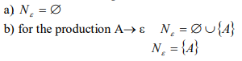
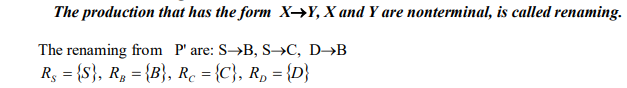
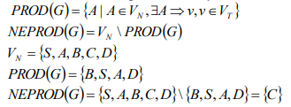
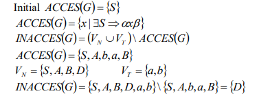
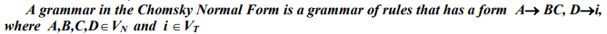

# Chomsky Normal Form.

### Course: Formal Languages & Finite Automata
### Author: Gusev Roman
### Academic Group: FAF-222

----

## Theory:
* ### Definitions:
  * **Chomsky Normal Form**: in formal language theory, a context-free grammar, G, is said to be in Chomsky normal form (first described by Noam Chomsky) if all of its production rules are of the form:
    * A → BC, or
    * A → a, or
    * S → ε,
## Objectives:
* Learn about Chomsky Normal Form (CNF) [[1]](#bib1).
* Get familiar with the approaches of normalizing a grammar.
* Implement a method for normalizing an input grammar by the rules of CNF:
  1. The implementation needs to be encapsulated in a method with an appropriate signature (also ideally in an appropriate class/type).
  2. The implemented functionality needs executed and tested.
  3. **A BONUS point** will be given for the student who will have unit tests that validate the functionality of the project.
  4. Also, another **BONUS point** would be given if the student will make the aforementioned function to accept any grammar, not only the one from the student's variant.

## Implementation description
* For the start, I used the files that were developed in the [Laboratory Work nr.1](../../Laboratory-Work-1-Grammar-Finite-Automaton) 
and the files that were changed in the [Laboratory Work nr.2](../../Laboratory-Work-2-Conversion-NFA-2-DFA), that are related to Grammar.
During the development of the project for current Laboratory Work, I added new features to Grammar class, that are related
to the conversion of CFG to CNF.
* First of all, I added the automatic check for the type of grammar, which assigns a type to the Grammar that is being constructed
which was used in the algorithm to check if the grammar is of type 2 - Context-Free Grammar, that is the required type
for the conversion into Chomsky Normal Form. This was done by simply adding a new variable to the Constructor, that is
not required/mandatory, because it will be assigned a value when the grammar is constructed anyway.
```python
...
class Grammar:
    ...
    def __init__(self, V_n=None, V_t=None, P=None, S=None, type=None):
        self.type_grammar = type
        if V_n is None or V_t is None or P is None or S is None:
            self.create_grammar()
        else:
            self.V_n = V_n
            self.V_t = V_t
            self.P = P
            for v in self.P.values():
                for deriv in v:
                    if deriv == "epsilon":
                        v.remove(deriv)
                        v.add("\u03B5")
            self.S = S
            if type is None:
                self.check_type_grammar()
    ...
```

* For the task - develop an algorithm that will convert CFG to CNF, I decided to delve in the 
research and found an algorithm that will permit to do this [[2]](#bib2):
  * Step 1 - Eliminate ε-productions:  
    
  * Step 2 - Eliminate unit-productions:
    
  * Step 3 - Eliminate unproductive-productions:
    
  * Step 4 - Eliminate inaccessible symbols:
     
  * Step 5 - Perform conversion to Chomsky Normal Form:
    
```python
...
class Grammar:
    ...
    def convert_to_Chomsky_Normal_Form(self):
        if self.type_grammar == 2:
            print("\nPerforming Conversion to Chomsky Normal Form...")
            print("\nPerforming Elimination of \u03B5-productions...")
            new_P = self.eliminate_epsilon_productions()

            print("\nPerforming Elimination of unit-productions...")
            new_P = self.eliminate_unit_productions(new_P)

            print("Performing Elimination of unproductive Symbols...")
            new_P, new_V_n = self.eliminate_unproductive_symbols(new_P)

            print("\nPerforming Elimination of inaccessible symbols...")
            new_P, new_V_n = self.eliminate_inaccessible_symbols(new_P, new_V_n)
            
            print("\nConverting to Chomsky Normal Form...")
            ...
            print("CFG IN CHOSMKY NORMAL FORM:")
            print("S =", new_S)
            print("V_t =", new_V_t)
            new_V_n = set(new_P.keys())
            print("V_n =", new_V_n)
            print("P = {")
            for (k, v) in new_P.items():
                print("  " + k, "->", v)
            print("}")

            return Grammar(V_n=new_V_n, V_t=new_V_t, P=new_P, S=new_S, type=self.type_grammar)
        else:
            print("Grammar is not of type 2! Can't convert to Chomsky Normal Form!")
            return None
    ...
```

* Step 1 of the algorithm is to eliminate ε-productions. First of all, I created a new dictionary that will hold new Production Rules.
After that, I iterate over the original dictionary of rules, and find all production that are deriving directly in "ε" and add
the corresponding Non-Terminal from the Left-Hand Side (LHS), to the set of nullable symbols. Otherwise, if it finds a production
that does not lead to "ε" - add to the new Production Rules set.
```python
...
class Grammar:
    ...
    def eliminate_epsilon_productions(self):
        new_P = {}
        # Declare empty set that will hold symbols from LHS that derive into ε
        set_nullable_symbols = set()
        # Iterate over all the production Rules
        for (LHS, RHS) in self.P.items():
            # Iterate over all the RHS possible derivations
            for production in RHS:
                # If derivation is ε, then add this symbol to the set from above
                    if production == "\u03B5":
                        set_nullable_symbols.add(LHS)
                    else:
                        if LHS not in new_P:
                            new_P[LHS] = {production}
                        else:
                            new_P[LHS].add(production)
        ...
```

* Here, I find all the rest nullable symbols, that are leading indirectly to "ε", through over Non-Terminals that lead
to "ε". This loop is performed until the new set of nullable symbols is similar with the one from the start of the iteration,
which means that no more nullable symbols are present in the Grammar. 
```python
...
class Grammar:
    ...
    def eliminate_epsilon_productions(self):
        ...
        while True:
            copy_set = set_nullable_symbols.copy()
            for (LHS, RHS) in self.P.items():
                for production in RHS:
                    flag = False
                    for symbol in production:
                        if symbol not in set_nullable_symbols:
                            flag = True
                    if not flag:
                        set_nullable_symbols.add(LHS)
            if copy_set == set_nullable_symbols:
                break

        print("Set of Nullable Symbols =", set_nullable_symbols)
        ...
```

* Here, I iterate over the set of nullable symbols and each production in the Grammar Productions Set and separate the
productions into symbols, using list, and find the index of the nullable symbol in this specific production. In order to
eliminate "ε"-production from another productions that have Non-Terminal Terms that indirectly lead to "ε"-productions,
I have to find all possible combinations, i.e., the powerset - which will contain all the combinations of the Non-Terminal Term
being placed in the derivation.
```python
...
from itertools import chain, combinations

def powerset(iterable):
    s = list(iterable)
    return chain.from_iterable(combinations(s, r) for r in range(len(s) + 1))

class Grammar:
    ...
    def eliminate_epsilon_productions(self):
        ...
        copy_p = new_P.copy()
        if len(set_nullable_symbols) > 0:
            for nullable_symbol in set_nullable_symbols:
                print("\nFor Nullable Symbol =", nullable_symbol)
                for (LHS, RHS) in new_P.items():
                    new_productions = set()  # Store new productions here
                    for production in RHS:
                        symbols = list(production)
                        indices = [i for i, v in enumerate(symbols) if v == nullable_symbol]
                        power_set = powerset(indices)
                        for replacements in power_set:
                            new_words = list(symbols)
                            for index in replacements:
                                new_words[index] = ""
                            new_production = "".join(new_words)
                            if new_production != production:
                                new_productions.add(new_production)
                            if "" in new_productions:
                                new_productions.remove("")
                    # Update original set after the loop
                    old_productions = copy_p[LHS].copy()
                    copy_p[LHS].update(new_productions)
                    if old_productions != copy_p[LHS]:
                        print(f"OLD RULE: {LHS} -> {old_productions}")
                        print(f"NEW RULE: {LHS} -> {copy_p[LHS]}")
                        print(f"DIFFERENCE: {copy_p[LHS].difference(old_productions)}")
            new_P = copy_p
        if len(set_nullable_symbols) > 0:
            print("\nNew Production Rules without \u03B5-productions:")
            print("P = {")
            for (k, v) in new_P.items():
                print("  " + k, "->", v)
            print("}")
        else:
            print("No \u03B5-productions were found!")
        return new_P
    ...
```

* Step 2 in this algorithm is to eliminate all unit-productions. In the same manner, I iterate in a while loop until there are
no more unit productions in the grammar productions. Unit productions are productions that have one Non-Terminal Term in the 
Right-Hand Side (RHS) in the production, which can be shortened/replaced with the production of that one Non-Terminal Term.
I check this using simple if-else statements, which are inside loops that iterate over the constantly changing set of Productions.
```python
class Grammar:
    ...
    def eliminate_unit_productions(self, new_P):
        prev_P = new_P.copy()
        copy_p = new_P.copy()
        has_unit_productions = True
        iteration = 0
        while has_unit_productions:
            iteration += 1
            print(f"Iteration {iteration}:")
            has_unit_productions = False
            nr_unit_production = 0
            for (LHS, RHS) in new_P.items():
                RHS_copy = RHS.copy()  # Create a copy of the RHS set
                for production in RHS_copy:
                    if len(production) == 1 and production.isupper():
                        nr_unit_production += 1
                        print(f"Unit Production {nr_unit_production}: {LHS} -> {production}")
                        new_derivations = copy_p[LHS].union(new_P[production])
                        new_derivations.remove(production)
                        copy_p[LHS] = new_derivations
                new_P = copy_p
            for (LHS, RHS) in new_P.items():
                for production in RHS:
                    if len(production) == 1 and production.isupper():
                        has_unit_productions = True
            print(f"New Production Rules after iteration {iteration}:")
            print("P = {")
            for (k, v) in new_P.items():
                print("  " + k, "->", v)
            print("}")
        new_P = copy_p
        ...
```

* Step 3 of the algorithm is to eliminate all Unproductive Rules, which is exactly the rules that can not lead to 
terminal terms, i.e., that can not be used to finish a word. In this code snippet, I use the same while loop approach,
that iterates until the grammar has no more productive symbols/rules. I can find the Unproductive rules by finding the productive 
and extracting the unproductive rules. Inside this loop, I iterate over the productions set gained after the step 2 and 
find the cases where the rule is productive:
  * if the LHS derives in a single Terminal Term, it is a productive rule.
  * if the LHS derives in multiple single Terminal Terms, it is a productive rule.
  * if the LHS derives in a string ∈ (V<sub>N</sub> U V<sub>T</sub>)<sup>*</sup>, and the Non-Terminals that are in this string
  are in the set of productive symbols, i.e., they lead to Terminal Term.
```python
...
class Grammar:
    ...
    def eliminate_unproductive_symbols(self, new_P):
        productive_symbols_set = set()
        productive_productions = {}
        iteration = 0
        has_unproductive_symbols = True
        print("Finding Productive Symbols:")
        while has_unproductive_symbols:
            iteration += 1
            print(f"Iteration {iteration}:")
            prev_productive_productions = productive_productions.copy()
            for (LHS, RHS) in new_P.items():
                for production in RHS:
                    if len(production) == 1:
                        if production in self.V_t:
                            if LHS not in productive_symbols_set:
                                print(f"{LHS} -> {production}")
                            productive_symbols_set.add(LHS)
                            if LHS not in productive_productions:
                                productive_productions[LHS] = {production}
                            else:
                                productive_productions[LHS].add(production)
                    else:
                        is_productive = True
                        for symbol in production:
                            if symbol.isupper():
                                if symbol not in productive_symbols_set:
                                    is_productive = False
                        if is_productive:
                            print(f"{LHS} -> {production}")
                            productive_symbols_set.add(LHS)
                            if LHS not in productive_productions:
                                productive_productions[LHS] = {production}
                            else:
                                productive_productions[LHS].add(production)
            ...
            # Check if there's any change in productive_productions
            if prev_productive_productions == productive_productions:
                print("No more productive productions")
                has_unproductive_symbols = False
        ...
```

* Step 4 in the algorithm is to eliminate inaccessible symbols. First of all, I add the productions for Start Symbols.
Then, if the symbol can be reached, i.e., if it is reachable from other productions, then it is an accessible symbol.
Then, I find the set of inaccessible symbols, which is the difference between the set of Non-Terminal Terms and the Accessible
Symbols. Then, I delete the productions that are related to that Non-Terminal that is not accessible.
```python
...
class Grammar:
    ...
    def eliminate_inaccessible_symbols(self, new_P, new_V_n):
        prev_P = new_P.copy()
        copy_P = new_P.copy()
        accessible_symbols_set = set()
        for (LHS, RHS) in new_P.items():
            for production in RHS:
                if LHS == self.S:
                    accessible_symbols_set.add(LHS)
                for symbol in production:
                    if symbol.isupper() and symbol != LHS:
                        accessible_symbols_set.add(symbol)
        inaccessible_symbols_set = new_V_n.difference(accessible_symbols_set)
        print("Set of Accessible Symbols =", accessible_symbols_set)
        print("Set of Inaccessible Symbols =", inaccessible_symbols_set)
        for inaccessible_symbol in inaccessible_symbols_set:
            try:
                copy_P.pop(inaccessible_symbol)
            except KeyError:
                continue
        new_V_n = accessible_symbols_set
        new_P = copy_P
        ...
        return new_P, new_V_n
    ...
```

* Step 5 is to perform the conversion of the simplified CFG to CNF. First of all, I create the set of Terminal Terms and
delete from it the added previously "ε" in it, and then each production i separate into symbols, in order to easily
add the Non-Terminal in place of older terms.
```python
...
class Grammar:
    ...
    def convert_to_Chomsky_Normal_Form(self):
        if self.type_grammar == 2:
            ...
            print("\nConverting to Chomsky Normal Form...")
            new_V_t = self.V_t.copy()
            if "\u03B5" in new_V_t:
                new_V_t.remove("\u03B5")
            new_S = self.S
            for (LHS, RHS) in new_P.items():
                new_RHS = set()
                for production in RHS:
                    new_RHS.add(tuple(production))
                new_P[LHS] = new_RHS
    ...
```

* In this part of the code, I iterate until no more new rules appear in the Grammar Productions Set. I add the following
rules directly in the new Productions Set:
  * if the RHS contains only one Terminal Term, it is a valid production in CNF form.
  * if the RHS contains only two Non-Terminal Terms, it is a valid production in CNF form.
* Other types of productions should be shortened. If the production starts with Terminal Term and rest of the string is
composed of Terminal Terms and Non-Terminal ones, first Terminal Term is replaced by a Non-Terminal and added a new rule to the
productions set, and the rest of the string is replaced by another Non-Terminal that is added to the productions set, and
is further analyzed on the structure matter, going back in a some kind of loop, ensuring that all the new Non-Terminal Terms
are also reduced to CNF form.
```python
...
import re
...
class Grammar:
    ...
    def convert_to_Chomsky_Normal_Form(self):
        if self.type_grammar == 2:
            ...
            has_new_rules = True
            iteration = 0
            while has_new_rules:
                copy_P = new_P.copy()
                iteration += 1
                print("Iteration {}".format(iteration))
                for (LHS, RHS) in new_P.items():
                    for production in set(RHS):
                        if type(production) is tuple:
                            production_list = list(production)
                        else:
                            break
                        if len(production_list) == 1 and production_list[0] in new_V_t:
                            print(f"DELETED RULE: {LHS} -> {production}")
                            copy_P[LHS].remove(production)
                            copy_P[LHS].add("".join(production_list))
                            print(f"ADDED RULE: {LHS} -> {"".join(production_list)}")
                            ...
                        else:
                            if len(production_list) >= 2:
                                copy_old_list = production
                                copy_P[LHS].remove(production)
                                for symbol in production_list:
                                    if symbol in new_V_t:
                                        new_Non_Terminal = symbol.upper() + "(" + symbol + ")"
                                        new_V_n.add(new_Non_Terminal)
                                        production_list[production_list.index(symbol)] = new_Non_Terminal
                                        if new_Non_Terminal not in copy_P:
                                            copy_P[new_Non_Terminal] = {symbol}
                                            print(f"ADDED RULE: {new_Non_Terminal} -> {symbol}")
                                            ...
                                        else:
                                            copy_P[new_Non_Terminal].add(symbol)
                                if len(production_list) == 2:
                                    copy_P[LHS].add("".join(production_list))
                                    print(f"DELETED RULE: {LHS} -> {copy_old_list}")
                                    print(f"ADDED RULE: {LHS} -> {"".join(production_list)}")
                                    ...
                                else:
                                    new_production = [production_list[0]]
                                    rest_production = production_list[1:len(production_list)]
                                    non_terminal_to_post = ""
                                    lst_existing_new_non_terminal = set(
                                        [key for key in copy_P.keys() if re.match(r'^D\(\d+\)$', key)])
                                    for key in lst_existing_new_non_terminal:
                                        if ("".join(rest_production) == "".join("".join(item) for item in copy_P[key])
                                                and re.match(r'^D\(\d+\)$', key)):
                                            non_terminal_to_post = key
                                    if non_terminal_to_post == "":
                                        new_int = len(lst_existing_new_non_terminal) + 1
                                        non_terminal_to_post = f"D({str(new_int)})"
                                    new_production.append(non_terminal_to_post)
                                    copy_P[non_terminal_to_post] = {tuple(rest_production)}
                                    print(f"DELETED RULE: {LHS} -> {"".join(production_list)}")
                                    print(f"ADDED RULE: {LHS} -> {"".join(new_production)}")
                                    print(f"NEW ADDED RULE: {non_terminal_to_post} -> {"".join(rest_production)}")
                                    copy_P[LHS].add("".join(new_production))
                                    ...
                if copy_P == new_P:
                    ...
                    has_new_rules = False
                else:
                    new_P = copy_P
    ...
```

* After all those steps, I create a new Grammar of CNF Form and return it and print the variables of the new Grammar.
```python
...
class Grammar:
    ...
    def convert_to_Chomsky_Normal_Form(self):
        if self.type_grammar == 2:
        ...
        print("CFG IN CHOSMKY NORMAL FORM:")
        print("S =", new_S)
        print("V_t =", new_V_t)
        new_V_n = set(new_P.keys())
        print("V_n =", new_V_n)
        print("P = {")
        for (k, v) in new_P.items():
            print("  " + k, "->", v)
        print("}")

        return Grammar(V_n=new_V_n, V_t=new_V_t, P=new_P, S=new_S, type=self.type_grammar)
```

* For the next task, which was to include some Unit Tests for each method, I decided to use library "unittest". I designed 5
Unit Test classes for each step of the algorithm, excluding the last one due to the fact that I could not find all possible
forms of final CNF Grammar for expected productions (due to the fact that I add new Non-Terminals in the productions in form
of "D(x)" where x is an integer, and the productions can't be repeated, but they may hold different derivations, that makes it 
difficult to find the expected static form of the grammar, due to its volatility and forms or representations). But I 
checked all the grammars that were present in the Unit Tests separately and compared them to the JFLAP [[3]](#bib3) version
of CNF of CFG that I used for Unit Tests and obtained the same results. For each Unit Test, I developed 5 grammars, that are
different and tested the methods on each of them and all the tests were passed, as you will see in the conclusion part. Here
is presented the Unit Test class for checking Epsilon Removal Algorithm and some setUp parts from it together with
the test methods. In the same manner are designed all the other unit tests.
```python
import unittest
from .. import Grammar

class UnitTestsEpsilonElimination(unittest.TestCase):
    def setUp(self):
        V_n = {"S", "X", "Y"}
        V_t = {"0", "1"}
        P = {
            "S": {"XYX"},
            "X": {"0X", "epsilon"},
            "Y": {"1Y", "epsilon"},
        }
        S = "S"
        type_grammar = 2
        self.grammar1 = Grammar.Grammar(V_t=V_t, V_n=V_n, P=P, S=S, type=type_grammar)
        ...
        V_n = {"S", "A", "B", "C", "D"}
        V_t = {"a", "b", "c"}
        P = {
            "S": {"ABC", "aA", "bB", "CD", "epsilon"},
            "A": {"aA", "Aa", "D", "B"},
            "B": {"bB", "BC", "C", "epsilon"},
            "C": {"cC", "Cc", "D"},
            "D": {"AD", "aD", "B"},
            "E": {"epsilon", "S"}
        }
        S = "S"
        type_grammar = 2
        self.grammar5 = Grammar.Grammar(V_t=V_t, V_n=V_n, P=P, S=S, type=type_grammar)

    def test_eliminate_epsilon_productions_1(self):
        new_P = self.grammar1.eliminate_epsilon_productions()
        expected_new_P = {
            "S": {"XYX", "XY", "YX", "Y", "XX", "X"},
            "X": {"0X", "0"},
            "Y": {"1Y", "1"}
        }
        self.assertEqual(new_P, expected_new_P)
    ...
    def test_eliminate_epsilon_productions_5(self):
        new_P = self.grammar5.eliminate_epsilon_productions()
        expected_new_P = {
            "S": {"ABC", "aA", "bB", "C", "CD", "A", "AB", "AC", "B", "BC", "a", "b", "D"},
            "A": {"aA", "Aa", "D", "B", "a"},
            "B": {"bB", "BC", "C", "b", "B"},
            "C": {"cC", "Cc", "D", "c"},
            "D": {"AD", "aD", "B", "A", "D", "a"},
            "E": {"S"}
        }
        self.assertEqual(new_P, expected_new_P)

if __name__ == "__main__":
    unittest.main()
```

* The main block for this laboratory work is here. I input my variant Grammar.
```python
...
import Grammar
...
if __name__ == '__main__':
    print("Laboratory Work 5 - Chomsky Normal Form.")
    print("Variant: 11")
    print("Student: Gusev Roman")
    print("Group: FAF-222")

    # Non-Terminal Terms
    V_n = {"S", "A", "B", "D", "C"}
    ...
    # Terminal Terms
    V_t = {"a", "b"}
    ...
    P = {
        "S": {"bA", "AC"},
        "A": {"bS", "BC", "AbAa"},
        "B": {"BbaA", "a", "bSa"},
        "C": {"epsilon"},
        "D": {"AB"}
    }
    ...
    # Start Term
    S = "S"
    ...
```

* Here I create the Grammar from my Variant and then create the new CNF Grammar:
```python
...
import Grammar
...
if __name__ == '__main__':
    ...
    # -----------------------------HERE STARTS LAB 5--------------------------------------------------------------------

    # Instance of Grammar Class with uppercase notation of Non-Terminal Terms
    print("\nGenerating Grammar from Input from Laboratory Work 5...")
    grammar = Grammar.Grammar(V_n, V_t, P, S)

    print("Printing Grammar from Input from Laboratory Work 5:", end="")
    grammar.print_variables()

    # Check the Grammar type from Laboratory Work 5
    print("Checking Type of Grammar:")
    grammar.check_type_grammar()

    CNF_Grammar = grammar.convert_to_Chomsky_Normal_Form()
    ...
```

## Conclusions / Screenshots / Results:
I present here the output for the tasks of the Laboratory Work nr.5.
* First part of the console output is the general information about the laboratory work, variant, student and group:
```
Laboratory Work 5 - Chomsky Normal Form.
Variant: 11
Student: Gusev Roman
Group: FAF-222
```

* After that goes the condition I got in my variant - Grammar, that is then converted to Chomsky Normal Form:
```
Generating Grammar from Input from Laboratory Work 5...
Grammar is: Type 2 - Context-Free Grammar
Printing Grammar from Input from Laboratory Work 5:
V_n = {'C', 'B', 'A', 'S', 'D'}
V_t = {'b', 'ε', 'a'}
S = S
P = {
  S -> {'AC', 'bA'}
  A -> {'AbAa', 'bS', 'BC'}
  B -> {'bSa', 'BbaA', 'a'}
  C -> {'ε'}
  D -> {'AB'}
}
```

* After that goes the check of the grammar from the previous Laboratory Work nr.1 by Chomsky Hierarchy:
```
Checking Type of Grammar:
Grammar is: Type 2 - Context-Free Grammar
```

* After that, a string is printed that signifies that the process of conversion to CNF is started
```
Performing Conversion to Chomsky Normal Form...
```

* After that, a string is printed that signifies that the process of elimination of "ε"-productions is started.
At the same time, is printed the set of Nullable Symbols.
```
Performing Elimination of ε-productions...
Set of Nullable Symbols = {'C'}
```

* After that, for each nullable symbol, the other productions that contained in the RHS part this specific nullable
symbol is then expanded into new productions. Also, is printed the difference - what new productions were added.
```
For Nullable Symbol = C
OLD RULE: S -> {'AC', 'bA'}
NEW RULE: S -> {'AC', 'bA', 'A'}
DIFFERENCE: {'A'}
OLD RULE: A -> {'AbAa', 'bS', 'BC'}
NEW RULE: A -> {'AbAa', 'B', 'bS', 'BC'}
DIFFERENCE: {'B'}
```

* Finally, the process ends with the print of the new Production Rules that have no "ε"-productions in them:
```
New Production Rules without ε-productions:
P = {
  S -> {'AC', 'bA', 'A'}
  A -> {'AbAa', 'B', 'bS', 'BC'}
  B -> {'bSa', 'BbaA', 'a'}
  D -> {'AB'}
}
```

* After that, a string is printed that signifies that the process of elimination of unit-productions is started.
```
Performing Elimination of unit-productions...
```

* After that, iteration by iteration, are presented the existing unit productions and how the production Rules are
changed during each iteration, displaying the old set of productions with the unit production and with the expanded.
```
Iteration 1:
Old Productions: S -> {'AC', 'bA', 'A'}
Unit Production 1: S -> A
New Productions: S -> {'AbAa', 'bA', 'BC', 'bS', 'AC', 'B'}
Old Productions: A -> {'BC', 'AbAa', 'bS', 'B'}
Unit Production 2: A -> B
New Productions: A -> {'a', 'AbAa', 'bSa', 'BC', 'BbaA', 'bS'}
New Production Rules after iteration 1:
P = {
  S -> {'AbAa', 'bA', 'BC', 'bS', 'AC', 'B'}
  A -> {'a', 'AbAa', 'bSa', 'BC', 'BbaA', 'bS'}
  B -> {'a', 'bSa', 'BbaA'}
  D -> {'AB'}
}
Iteration 2:
Old Productions: S -> {'AbAa', 'bA', 'BC', 'bS', 'AC', 'B'}
Unit Production 1: S -> B
New Productions: S -> {'bS', 'a', 'AbAa', 'bA', 'bSa', 'BC', 'BbaA', 'AC'}
New Production Rules after iteration 2:
P = {
  S -> {'bS', 'a', 'AbAa', 'bA', 'bSa', 'BC', 'BbaA', 'AC'}
  A -> {'a', 'AbAa', 'bSa', 'BC', 'BbaA', 'bS'}
  B -> {'a', 'bSa', 'BbaA'}
  D -> {'AB'}
}
```

* Finally, the process ends with the print of the new Production Rules that have no "ε"-productions and no unit-productions in them:
```
New Production Rules without ε-productions and unit-productions:
P = {
  S -> {'bS', 'a', 'AbAa', 'bA', 'bSa', 'BC', 'BbaA', 'AC'}
  A -> {'a', 'AbAa', 'bSa', 'BC', 'BbaA', 'bS'}
  B -> {'a', 'bSa', 'BbaA'}
  D -> {'AB'}
}
```

* After that, is presented the difference in the rules between the previous step and current.
```
Difference between previous Production Rules and Production Rules without Unit Productions:
Expanded/Removed Unit Productions = {
  S -> {'A'}
  A -> {'B'}
}
```

* After that, a string is printed that signifies that the process of elimination of unproductive-productions is started.
```
Performing Elimination of unproductive Symbols...
```

* After that, iteration by iteration, are presented the existing productive productions and how the production Rules are
changed during each iteration.
```
Finding Productive Symbols:
Iteration 1:
S -> a
S -> bSa
A -> a
A -> AbAa
A -> bSa
A -> bS
B -> a
B -> bSa
B -> BbaA
D -> AB
New Production Rules after iteration 1:
P = {
  S -> {'bSa', 'a'}
  A -> {'bSa', 'a', 'AbAa', 'bS'}
  B -> {'bSa', 'a', 'BbaA'}
  D -> {'AB'}
}
Iteration 2:
S -> bS
S -> AbAa
S -> bA
S -> bSa
S -> BbaA
A -> AbAa
A -> bSa
A -> BbaA
A -> bS
B -> bSa
B -> BbaA
D -> AB
New Production Rules after iteration 2:
P = {
  S -> {'a', 'AbAa', 'bA', 'bSa', 'BbaA', 'bS'}
  A -> {'a', 'AbAa', 'bSa', 'BbaA', 'bS'}
  B -> {'bSa', 'a', 'BbaA'}
  D -> {'AB'}
}
```

* At the end of this process, is displayed a message that signifies that no more productive productions were found:
```
No more productive productions
```

* Finally, the process ends with the print of the new set of Non-Terminal Terms and the new Production Rules that have no "ε"-productions, no unit-productions
and no unproductive productions in them:
```
Set of Productive Non-Terminal Terms: {'D', 'S', 'B', 'A'}

New Production Rules without ε-productions, unit-productions, unproductive-productions:
P = {
  S -> {'a', 'AbAa', 'bA', 'bSa', 'BbaA', 'bS'}
  A -> {'a', 'AbAa', 'bSa', 'BbaA', 'bS'}
  B -> {'bSa', 'a', 'BbaA'}
  D -> {'AB'}
}
```

* After that, is presented the difference in the rules between the previous step and current.
```
Difference between previous Production Rules and productive Production Rules:
Removed Unproductive Rules = {
  S -> {'BC', 'AC'}
  A -> {'BC'}
}
```

* After that, a string is printed that signifies that the process of elimination of inaccessible symbols is started.
```
Performing Elimination of inaccessible symbols...
```
* Then, are presented the set of accessible and inaccessible symbols, together with the new set of Non-Terminal Terms:
```
Set of Accessible Symbols = {'S', 'B', 'A'}
Set of Inaccessible Symbols = {'D'}

New Set of Non-Terminal Terms: {'S', 'B', 'A'}
```

* After that, iteration by iteration, are presented the existing useful productions and the non-terminal symbols that were
removed from the productions.
```
New Production Rules without ε-productions, unit-productions, unproductive-productions and inaccessible symbols:
P = {
  S -> {'a', 'AbAa', 'bA', 'bSa', 'BbaA', 'bS'}
  A -> {'a', 'AbAa', 'bSa', 'BbaA', 'bS'}
  B -> {'bSa', 'a', 'BbaA'}
}
Non-terminal symbols removed: {'D'}
```

* After that, is presented the difference in the rules between the previous step and current.
```
Difference between previous Production Rules and Production Rules without inaccessible symbols:
Rules that were removed:
Removed_Rules = {
  D -> {'AB'}
}
```

* After that, a string is printed that signifies that the process of conversion to CNF is started.
```
Converting to Chomsky Normal Form...
```

* After that, iteration by iteration, are presented the existing productions in CNF and how the production Rules are
changed during each iteration. I present all of them in order to show how it is done iteration by iteration, alongside
with the new added rules, deleted rules, new Non-Terminals.
```
Iteration 1
ADDED RULE: B(b) -> b
P = {
  S -> {('b', 'S'), ('b', 'S', 'a'), ('B', 'b', 'a', 'A'), ('b', 'A'), ('a',)}
  A -> {('A', 'b', 'A', 'a'), ('b', 'S'), ('b', 'S', 'a'), ('B', 'b', 'a', 'A'), ('a',)}
  B -> {('a',), ('b', 'S', 'a'), ('B', 'b', 'a', 'A')}
  B(b) -> {'b'}
}
ADDED RULE: A(a) -> a
...
DELETED RULE: S -> AB(b)AA(a)
ADDED RULE: S -> AD(1)
NEW ADDED RULE: D(1) -> B(b)AA(a)
P = {
  S -> {('b', 'S'), ('b', 'S', 'a'), 'AD(1)', ('B', 'b', 'a', 'A'), ('b', 'A'), ('a',)}
  A -> {('A', 'b', 'A', 'a'), ('b', 'S'), ('b', 'S', 'a'), ('B', 'b', 'a', 'A'), ('a',)}
  B -> {('a',), ('b', 'S', 'a'), ('B', 'b', 'a', 'A')}
  B(b) -> {'b'}
  A(a) -> {'a'}
  D(1) -> {('B(b)', 'A', 'A(a)')}
}
...
DELETED RULE: B -> ('a',)
ADDED RULE: B -> a
P = {
  S -> {'B(b)D(2)', 'AD(1)', 'a', 'B(b)A', 'B(b)S', 'BD(3)'}
  A -> {'B(b)D(2)', 'AD(1)', 'a', 'B(b)S', 'BD(3)'}
  B -> {'a', ('b', 'S', 'a'), ('B', 'b', 'a', 'A')}
  B(b) -> {'b'}
  A(a) -> {'a'}
  D(1) -> {('B(b)', 'A', 'A(a)')}
  D(2) -> {('S', 'A(a)')}
  D(3) -> {('B(b)', 'A(a)', 'A')}
}
...
Iteration 3
DELETED RULE: D(4) -> ('A', 'A(a)')
ADDED RULE: D(4) -> AA(a)
P = {
  S -> {'B(b)D(2)', 'AD(1)', 'a', 'B(b)A', 'B(b)S', 'BD(3)'}
  A -> {'B(b)D(2)', 'AD(1)', 'a', 'B(b)S', 'BD(3)'}
  B -> {'a', 'BD(3)', 'B(b)D(2)'}
  B(b) -> {'b'}
  A(a) -> {'a'}
  D(1) -> {'B(b)D(4)'}
  D(2) -> {'SA(a)'}
  D(3) -> {'B(b)D(5)'}
  D(4) -> {'AA(a)'}
  D(5) -> {('A(a)', 'A')}
}
DELETED RULE: D(5) -> ('A(a)', 'A')
ADDED RULE: D(5) -> A(a)A
P = {
  S -> {'B(b)D(2)', 'AD(1)', 'a', 'B(b)A', 'B(b)S', 'BD(3)'}
  A -> {'B(b)D(2)', 'AD(1)', 'a', 'B(b)S', 'BD(3)'}
  B -> {'a', 'BD(3)', 'B(b)D(2)'}
  B(b) -> {'b'}
  A(a) -> {'a'}
  D(1) -> {'B(b)D(4)'}
  D(2) -> {'SA(a)'}
  D(3) -> {'B(b)D(5)'}
  D(4) -> {'AA(a)'}
  D(5) -> {'A(a)A'}
}
```

* After that is printed the string that shows that there are no more rules and printed the last version of the
productions:
```
No new Rules.
V_n = {'D(3)', 'D(4)', 'B(b)', 'B', 'A', 'A(a)', 'D(1)', 'D(2)', 'D(5)', 'S'}
P = {
  S -> {'B(b)D(2)', 'AD(1)', 'a', 'B(b)A', 'B(b)S', 'BD(3)'}
  A -> {'B(b)D(2)', 'AD(1)', 'a', 'B(b)S', 'BD(3)'}
  B -> {'a', 'BD(3)', 'B(b)D(2)'}
  B(b) -> {'b'}
  A(a) -> {'a'}
  D(1) -> {'B(b)D(4)'}
  D(2) -> {'SA(a)'}
  D(3) -> {'B(b)D(5)'}
  D(4) -> {'AA(a)'}
  D(5) -> {'A(a)A'}
}
```

* After that, is presented the final version of the CNF Grammar that was constructed.
```
CFG IN CHOSMKY NORMAL FORM:
S = S
V_t = {'a', 'b'}
V_n = {'D(3)', 'D(4)', 'B(b)', 'B', 'A', 'A(a)', 'D(1)', 'D(2)', 'D(5)', 'S'}
P = {
  S -> {'B(b)D(2)', 'AD(1)', 'a', 'B(b)A', 'B(b)S', 'BD(3)'}
  A -> {'B(b)D(2)', 'AD(1)', 'a', 'B(b)S', 'BD(3)'}
  B -> {'a', 'BD(3)', 'B(b)D(2)'}
  B(b) -> {'b'}
  A(a) -> {'a'}
  D(1) -> {'B(b)D(4)'}
  D(2) -> {'SA(a)'}
  D(3) -> {'B(b)D(5)'}
  D(4) -> {'AA(a)'}
  D(5) -> {'A(a)A'}
}
```

* Here I present the Result of the Unit Tests, specifically for the Epsilon Removal:
```
C:\Python312\python.exe "D:/Programming/PyCharm 2023.3.2/plugins/python/helpers/pycharm/_jb_unittest_runner.py" --path D:\Programming\Projects\LFA-Laboratory-Works\Laboratory-Work-5-Chomsky-Normal-Form\UnitTests\EpsilonTest.py 
Testing started at 18:37 ...
Launching unittests with arguments python -m unittest D:\Programming\Projects\LFA-Laboratory-Works\Laboratory-Work-5-Chomsky-Normal-Form\UnitTests\EpsilonTest.py in D:\Programming\Projects\LFA-Laboratory-Works

Set of Nullable Symbols = {'Y', 'X', 'S'}

For Nullable Symbol = Y
OLD RULE: S -> {'XYX'}
NEW RULE: S -> {'XYX', 'XX'}
...
For Nullable Symbol = S

New Production Rules without ε-productions:
P = {
  S -> {'YX', 'Y', 'XY', 'XYX', 'X', 'XX'}
  X -> {'0X', '0'}
  Y -> {'1', '1Y'}
}
...
Set of Nullable Symbols = {'B', 'S', 'A', 'E', 'C', 'D'}

For Nullable Symbol = B
OLD RULE: S -> {'aA', 'bB', 'ABC', 'CD'}
NEW RULE: S -> {'b', 'aA', 'bB', 'ABC', 'CD', 'AC'}
DIFFERENCE: {'b', 'AC'}
OLD RULE: B -> {'BC', 'C', 'bB'}
NEW RULE: B -> {'b', 'BC', 'bB', 'C'}
DIFFERENCE: {'b'}

For Nullable Symbol = S
...

For Nullable Symbol = D
OLD RULE: D -> {'B', 'D', 'AD', 'aD'}
NEW RULE: D -> {'AD', 'A', 'aD', 'a', 'B', 'D'}
DIFFERENCE: {'A', 'a'}

New Production Rules without ε-productions:
P = {
  S -> {'b', 'aA', 'bB', 'ABC', 'a', 'AB', 'B', 'AC', 'BC', 'A', 'CD', 'C', 'D'}
  A -> {'Aa', 'aA', 'a', 'B', 'D'}
  B -> {'b', 'BC', 'bB', 'B', 'C'}
  C -> {'cC', 'Cc', 'D', 'c'}
  D -> {'AD', 'A', 'aD', 'a', 'B', 'D'}
  E -> {'S'}
}


Ran 5 tests in 0.021s

OK

Process finished with exit code 0
```

* Here I present the Result of the Unit Tests, specifically for the Unit Productions Removal:
```
C:\Python312\python.exe "D:/Programming/PyCharm 2023.3.2/plugins/python/helpers/pycharm/_jb_unittest_runner.py" --path D:\Programming\Projects\LFA-Laboratory-Works\Laboratory-Work-5-Chomsky-Normal-Form\UnitTests\UnitTest.py 
Testing started at 18:40 ...
Launching unittests with arguments python -m unittest D:\Programming\Projects\LFA-Laboratory-Works\Laboratory-Work-5-Chomsky-Normal-Form\UnitTests\UnitTest.py in D:\Programming\Projects\LFA-Laboratory-Works

Iteration 1:
Old Productions: S -> {'XX', 'XYX', 'YX', 'XY', 'X', 'Y'}
Unit Production 1: S -> X
New Productions: S -> {'XX', 'XYX', 'YX', 'XY', '0', '0X', 'Y'}
Old Productions: S -> {'XX', 'XYX', 'YX', 'XY', 'X', 'Y'}
Unit Production 2: S -> Y
New Productions: S -> {'YX', '0', 'XYX', 'XX', 'XY', '1Y', '0X', '1'}
New Production Rules after iteration 1:
P = {
  S -> {'YX', '0', 'XYX', 'XX', 'XY', '1Y', '0X', '1'}
  X -> {'0', '0X'}
  Y -> {'1Y', '1'}
}

New Production Rules without ε-productions and unit-productions:
P = {
  S -> {'YX', '0', 'XYX', 'XX', 'XY', '1Y', '0X', '1'}
  X -> {'0', '0X'}
  Y -> {'1Y', '1'}
}
Difference between previous Production Rules and Production Rules without Unit Productions:
Expanded/Removed Unit Productions = {
  S -> {'X', 'Y'}
}
...
Iteration 1:
Old Productions: S -> {'ABC', 'AC', 'A', 'AB', 'D', 'BC', 'aA', 'bB', 'CD', 'C', 'b', 'B', 'a'}
Unit Production 1: S -> A
New Productions: S -> {'ABC', 'AC', 'AB', 'Aa', 'D', 'BC', 'aA', 'bB', 'CD', 'C', 'b', 'B', 'a'}
Old Productions: S -> {'ABC', 'AC', 'A', 'AB', 'D', 'BC', 'aA', 'bB', 'CD', 'C', 'b', 'B', 'a'}
Unit Production 2: S -> D
New Productions: S -> {'AD', 'ABC', 'Aa', 'A', 'aD', 'aA', 'C', 'B', 'a', 'AC', 'AB', 'BC', 'bB', 'CD', 'b'}
Old Productions: S -> {'ABC', 'AC', 'A', 'AB', 'D', 'BC', 'aA', 'bB', 'CD', 'C', 'b', 'B', 'a'}
Unit Production 3: S -> C
...
Iteration 4:
Old Productions: S -> {'AD', 'ABC', 'Aa', 'aD', 'aA', 'c', 'C', 'cC', 'a', 'AC', 'AB', 'Cc', 'BC', 'bB', 'CD', 'b'}
Unit Production 1: S -> C
New Productions: S -> {'AD', 'ABC', 'Aa', 'aD', 'aA', 'c', 'cC', 'a', 'AC', 'AB', 'Cc', 'BC', 'bB', 'CD', 'b'}
Old Productions: A -> {'AD', 'Aa', 'aD', 'aA', 'c', 'C', 'cC', 'a', 'Cc', 'BC', 'bB', 'b'}
Unit Production 2: A -> C
New Productions: A -> {'AD', 'Aa', 'aD', 'aA', 'c', 'cC', 'a', 'Cc', 'BC', 'bB', 'b'}
New Production Rules after iteration 4:
P = {
  S -> {'AD', 'ABC', 'Aa', 'aD', 'aA', 'c', 'cC', 'a', 'AC', 'AB', 'Cc', 'BC', 'bB', 'CD', 'b'}
  A -> {'AD', 'Aa', 'aD', 'aA', 'c', 'cC', 'a', 'Cc', 'BC', 'bB', 'b'}
  B -> {'AD', 'Aa', 'aD', 'aA', 'c', 'cC', 'a', 'Cc', 'BC', 'bB', 'b'}
  C -> {'AD', 'Aa', 'Cc', 'BC', 'aD', 'aA', 'bB', 'c', 'cC', 'b', 'a'}
  D -> {'AD', 'Aa', 'aD', 'aA', 'c', 'cC', 'a', 'Cc', 'BC', 'bB', 'b'}
  E -> {'AD', 'ABC', 'Aa', 'aD', 'aA', 'c', 'cC', 'a', 'AC', 'AB', 'Cc', 'BC', 'bB', 'CD', 'b'}
}

New Production Rules without ε-productions and unit-productions:
P = {
  S -> {'AD', 'ABC', 'Aa', 'aD', 'aA', 'c', 'cC', 'a', 'AC', 'AB', 'Cc', 'BC', 'bB', 'CD', 'b'}
  A -> {'AD', 'Aa', 'aD', 'aA', 'c', 'cC', 'a', 'Cc', 'BC', 'bB', 'b'}
  B -> {'AD', 'Aa', 'aD', 'aA', 'c', 'cC', 'a', 'Cc', 'BC', 'bB', 'b'}
  C -> {'AD', 'Aa', 'Cc', 'BC', 'aD', 'aA', 'bB', 'c', 'cC', 'b', 'a'}
  D -> {'AD', 'Aa', 'aD', 'aA', 'c', 'cC', 'a', 'Cc', 'BC', 'bB', 'b'}
  E -> {'AD', 'ABC', 'Aa', 'aD', 'aA', 'c', 'cC', 'a', 'AC', 'AB', 'Cc', 'BC', 'bB', 'CD', 'b'}
}
Difference between previous Production Rules and Production Rules without Unit Productions:
Expanded/Removed Unit Productions = {
  S -> {'C', 'B', 'A', 'D'}
  A -> {'B', 'D'}
  B -> {'C', 'B'}
  C -> {'D'}
  D -> {'B', 'A', 'D'}
  E -> {'S'}
}


Ran 5 tests in 0.027s

OK

Process finished with exit code 0
```

* Here I present the Result of the Unit Tests, specifically for the Unproductive Productions Removal:
```
C:\Python312\python.exe "D:/Programming/PyCharm 2023.3.2/plugins/python/helpers/pycharm/_jb_unittest_runner.py" --path D:\Programming\Projects\LFA-Laboratory-Works\Laboratory-Work-5-Chomsky-Normal-Form\UnitTests\UnproductiveTest.py 
Testing started at 18:42 ...
Launching unittests with arguments python -m unittest D:\Programming\Projects\LFA-Laboratory-Works\Laboratory-Work-5-Chomsky-Normal-Form\UnitTests\UnproductiveTest.py in D:\Programming\Projects\LFA-Laboratory-Works

Finding Productive Symbols:
Iteration 1:
S -> 0
X -> 0
Y -> 1
New Production Rules after iteration 1:
P = {
  S -> {'1', '0'}
  X -> {'0'}
  Y -> {'1'}
}
Iteration 2:
S -> XX
S -> XY
...
X -> 0X
Y -> 1Y
New Production Rules after iteration 2:
P = {
  S -> {'0', '1', 'XX', 'XYX', 'YX', '0X', '1Y', 'XY'}
  X -> {'0X', '0'}
  Y -> {'1Y', '1'}
}
No more productive productions
No unproductive rules removed.

Production Rules stay the same:
P = {
  S -> {'0', '1', 'XX', 'XYX', 'YX', '0X', '1Y', 'XY'}
  X -> {'0X', '0'}
  Y -> {'1Y', '1'}
}
{'S', 'X', 'Y'}
...
Finding Productive Symbols:
Iteration 1:
S -> a
A -> a
A -> aA
A -> Aa
...
E -> AB
E -> bB
E -> Cc
E -> AC
New Production Rules after iteration 1:
P = {
  S -> {'a', 'b', 'c'}
  A -> {'a', 'b', 'aA', 'Aa', 'c'}
  B -> {'a', 'b', 'aA', 'Aa', 'c', 'bB'}
  C -> {'c', 'a', 'b', 'cC', 'BC', 'Aa', 'aA', 'bB', 'Cc'}
  D -> {'c', 'a', 'b', 'cC', 'BC', 'Aa', 'aA', 'bB', 'Cc'}
  E -> {'aD', 'c', 'AD', 'a', 'b', 'cC', 'AB', 'BC', 'ABC', 'Aa', 'aA', 'CD', 'bB', 'Cc', 'AC'}
}
Iteration 2:
S -> aD
S -> AD
S -> CD
...
E -> bB
E -> Cc
E -> AC
New Production Rules after iteration 2:
P = {
  S -> {'aD', 'AD', 'a', 'b', 'aA', 'cC', 'BC', 'AB', 'ABC', 'Aa', 'c', 'CD', 'bB', 'Cc', 'AC'}
  A -> {'aD', 'AD', 'a', 'b', 'aA', 'cC', 'BC', 'Aa', 'c', 'bB', 'Cc'}
  B -> {'aD', 'AD', 'a', 'b', 'aA', 'cC', 'BC', 'Aa', 'c', 'bB', 'Cc'}
  C -> {'aD', 'c', 'AD', 'a', 'b', 'cC', 'BC', 'Aa', 'aA', 'bB', 'Cc'}
  D -> {'aD', 'c', 'AD', 'a', 'b', 'cC', 'BC', 'Aa', 'aA', 'bB', 'Cc'}
  E -> {'aD', 'c', 'AD', 'a', 'b', 'cC', 'AB', 'BC', 'ABC', 'Aa', 'aA', 'CD', 'bB', 'Cc', 'AC'}
}
No more productive productions
No unproductive rules removed.

Production Rules stay the same:
P = {
  S -> {'aD', 'AD', 'a', 'b', 'aA', 'cC', 'BC', 'AB', 'ABC', 'Aa', 'c', 'CD', 'bB', 'Cc', 'AC'}
  A -> {'aD', 'AD', 'a', 'b', 'aA', 'cC', 'BC', 'Aa', 'c', 'bB', 'Cc'}
  B -> {'aD', 'AD', 'a', 'b', 'aA', 'cC', 'BC', 'Aa', 'c', 'bB', 'Cc'}
  C -> {'aD', 'c', 'AD', 'a', 'b', 'cC', 'BC', 'Aa', 'aA', 'bB', 'Cc'}
  D -> {'aD', 'c', 'AD', 'a', 'b', 'cC', 'BC', 'Aa', 'aA', 'bB', 'Cc'}
  E -> {'aD', 'c', 'AD', 'a', 'b', 'cC', 'AB', 'BC', 'ABC', 'Aa', 'aA', 'CD', 'bB', 'Cc', 'AC'}
}


Ran 5 tests in 0.038s

OK

Process finished with exit code 0
```

* Here I present the Result of the Unit Tests, specifically for the Inaccessible Productions Removal:
```
C:\Python312\python.exe "D:/Programming/PyCharm 2023.3.2/plugins/python/helpers/pycharm/_jb_unittest_runner.py" --path D:\Programming\Projects\LFA-Laboratory-Works\Laboratory-Work-5-Chomsky-Normal-Form\UnitTests\InaccessibleTest.py 
Testing started at 18:44 ...
Launching unittests with arguments python -m unittest D:\Programming\Projects\LFA-Laboratory-Works\Laboratory-Work-5-Chomsky-Normal-Form\UnitTests\InaccessibleTest.py in D:\Programming\Projects\LFA-Laboratory-Works

Set of Accessible Symbols = {'S', 'Y', 'X'}
Set of Inaccessible Symbols = {'Z'}

New Set of Non-Terminal Terms: {'S', 'Y', 'X'}

New Production Rules without ε-productions, unit-productions, unproductive-productions and inaccessible symbols:
P = {
  S -> {'0', '0X', '1Y', 'XY', 'XYX', 'XX', '1', 'YX'}
  X -> {'0', '0X'}
  Y -> {'1Y', '1'}
}
Non-terminal symbols removed: {'Z'}
Difference between previous Production Rules and Production Rules without inaccessible symbols:
Rules that were removed:
Removed_Rules = {
  Z -> {'1Y', '1'}
}
...
Set of Accessible Symbols = {'C', 'S', 'D', 'B', 'A'}
Set of Inaccessible Symbols = {'E'}

New Set of Non-Terminal Terms: {'C', 'S', 'D', 'B', 'A'}

New Production Rules without ε-productions, unit-productions, unproductive-productions and inaccessible symbols:
P = {
  S -> {'a', 'AD', 'AC', 'AB', 'CD', 'Cc', 'b', 'cC', 'ABC', 'Aa', 'aD', 'BC', 'c', 'bB', 'aA'}
  A -> {'a', 'AD', 'Cc', 'b', 'cC', 'Aa', 'aD', 'BC', 'c', 'bB', 'aA'}
  B -> {'a', 'AD', 'Cc', 'b', 'cC', 'Aa', 'aD', 'BC', 'c', 'bB', 'aA'}
  C -> {'a', 'AD', 'Cc', 'b', 'cC', 'Aa', 'aD', 'BC', 'c', 'bB', 'aA'}
  D -> {'a', 'AD', 'Cc', 'b', 'cC', 'Aa', 'aD', 'BC', 'c', 'bB', 'aA'}
}
Non-terminal symbols removed: {'E'}
Difference between previous Production Rules and Production Rules without inaccessible symbols:
Rules that were removed:
Removed_Rules = {
  E -> {'a', 'AD', 'AC', 'AB', 'CD', 'Cc', 'b', 'cC', 'ABC', 'Aa', 'aD', 'BC', 'c', 'bB', 'aA'}
}


Ran 5 tests in 0.015s

OK

Process finished with exit code 0
```

* Here I present the Result of the Unit Tests, specifically for the all mentioned above Productions Removal:
```
C:\Python312\python.exe "D:/Programming/PyCharm 2023.3.2/plugins/python/helpers/pycharm/_jb_unittest_runner.py" --path D:\Programming\Projects\LFA-Laboratory-Works\Laboratory-Work-5-Chomsky-Normal-Form\UnitTests\PreCNFConversionTest.py 
Testing started at 18:45 ...
Launching unittests with arguments python -m unittest D:\Programming\Projects\LFA-Laboratory-Works\Laboratory-Work-5-Chomsky-Normal-Form\UnitTests\PreCNFConversionTest.py in D:\Programming\Projects\LFA-Laboratory-Works
...
Production Rules stay the same:
P = {
  S -> {'XYX', 'YX', '0', 'XX', '0X', 'XY', '1', '1Y'}
  X -> {'0X', '0'}
  Y -> {'1', '1Y'}
}
...
New Production Rules without ε-productions, unit-productions, unproductive-productions and inaccessible symbols:
P = {
  S -> {'Aa', 'BC', 'AC', 'cC', 'AD', 'c', 'a', 'CD', 'AB', 'b', 'ABC', 'bB', 'aA', 'aD', 'Cc'}
  A -> {'Aa', 'BC', 'cC', 'AD', 'c', 'a', 'b', 'bB', 'aA', 'aD', 'Cc'}
  B -> {'Aa', 'BC', 'cC', 'AD', 'c', 'a', 'b', 'bB', 'aA', 'aD', 'Cc'}
  C -> {'Aa', 'BC', 'cC', 'AD', 'c', 'a', 'b', 'bB', 'aA', 'aD', 'Cc'}
  D -> {'Aa', 'BC', 'cC', 'AD', 'a', 'c', 'b', 'bB', 'aA', 'aD', 'Cc'}
}
Non-terminal symbols removed: {'E'}
Difference between previous Production Rules and Production Rules without inaccessible symbols:
Rules that were removed:
Removed_Rules = {
  E -> {'Aa', 'BC', 'cC', 'AC', 'AD', 'a', 'CD', 'AB', 'c', 'b', 'ABC', 'bB', 'aA', 'aD', 'Cc'}
}


Ran 5 tests in 0.100s

OK
```

As a conclusion to this Laboratory Work nr.5, I can say that I accomplished all the given tasks, specifically:
1. Provide a function in your grammar type/class that could convert the CFG in Chomsky Normal Form.
2. Add Unit Tests

Also, I managed to understand better the concept of Context-Free Grammars, how are they converted into CNF Grammars. 
Besides that, I understood how to use them in the future, especially for compiler code writing.
At the same time, I understood how to write Unit Tests for applications and certain methods.

## References:
<a id="bib1"></a>[1] “Chomsky normal form,” Wikipedia. Sep. 13, 2023. Available: https://en.wikipedia.org/w/index.php?title=Chomsky_normal_form&oldid=1175161174. [Accessed: Apr. 14, 2024]

<a id="bib1"></a>[2] “FAF.LFA21.1.Example Conversion CFG-to-CNF” Available: https://else.fcim.utm.md/enrol/index.php?id=98. [Accessed: Apr. 14, 2024]

<a id="bib1"></a>[3] “JFLAP.” Available: https://www.jflap.org/. [Accessed: Apr. 14, 2024]
